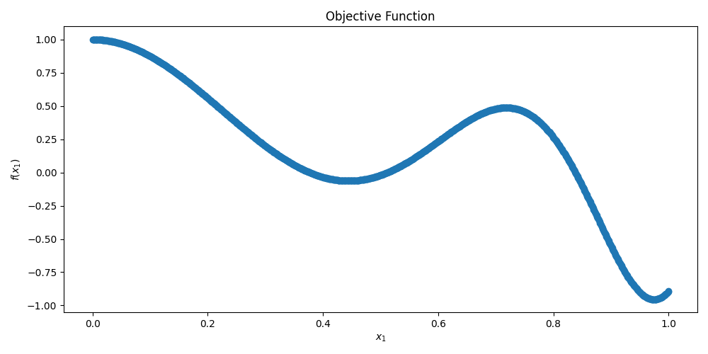

# direct_python

Python-based DIRECT optimizer compatible with the [AntennaCAT](https://github.com/LC-Linkous/AntennaCalculationAutotuningTool) optimizer suite.  Now featuring AntennaCAT hooks for GUI integration and user input handling.

DIRECT (DIviding RECTangles) [1] is a deterministic, derivative-free global optimizer. This is a clean-slate implementation built on the AntennaCAT `pso_basic` template with the decoupled `step()`/`call_objective()` structure, so that exactly one objective evaluation happens per controller loop pass. See the [DIRECT](#direct) and [Implementation Origin](#implementation-origin) sections for more information.

## Table of Contents
* [DIRECT](#direct)
* [Implementation Origin](#implementation-origin)
    * [Serializing a Batch Algorithm](#serializing-a-batch-algorithm)
    * [Streamlined Interface for AntennaCAT Optimizer Modularity](#streamlined-interface-for-antennacat-optimizer-modularity)
    * [Addition of Threshold vs. Target](#addition-of-threshold-vs-target)
* [Requirements](#requirements)
* [Implementation](#implementation)
    * [Initialization](#initialization) 
    * [State Machine-based Structure](#state-machine-based-structure)
    * [Constraint Handling](#constraint-handling)
    * [Boundary Types](#boundary-types)
    * [Objective Function Handling](#objective-function-handling)
      * [Creating a Custom Objective Function](#creating-a-custom-objective-function)
      * [Internal Objective Function Example](#internal-objective-function-example)
    * [Target vs. Threshold Configuration](#target-vs-threshold-configuration)
* [Example Implementations](#example-implementations)
    * [Basic Example](#basic-example)
    * [Detailed Messages](#detailed-messages)
    * [Realtime Graph](#realtime-graph)
* [References](#references)
* [Related Publications and Repositories](#related-publications-and-repositories)
* [Licensing](#licensing)  

## DIRECT

The DIviding RECTangles (DIRECT) algorithm, introduced by Jones, Perttunen, and Stuckman in 1993 [1], is a deterministic, derivative-free global optimizer (Lipschitzian optimization without the Lipschitz constant). It is a different shape of algorithm than the swarm set: it is fully deterministic (no RNG anywhere), and it maintains a partition of the search space rather than a population of agents.

DIRECT normalizes the search domain to the unit hypercube and maintains a set of hyperrectangles that always tile that cube exactly. Each rectangle is represented by its center point (where the objective has been evaluated) and its side lengths. Each DIRECT iteration has two moves:

1) Select:

    Identify the potentially optimal hyperrectangles - the rectangles that, for some rate-of-change constant K > 0, could contain a better point than every other rectangle. Formally, these lie on the lower-right convex hull of the cloud of points (size, fitness). Small rectangles with good values get selected (local refinement) AND large rectangles with mediocre values get selected (global exploration), simultaneously, with no tuning parameter governing the trade-off. The convex hull IS the exploration/exploitation balance. The EPS parameter (Jones' epsilon) prunes hull points that could not improve on the best value by a meaningful relative amount.

2) Divide:

    Each selected rectangle is divided along its longest dimensions. For each long dimension, two new points are sampled at center +/- (longest side / 3) and evaluated. The dimensions are then split in order of their best sampled value, best dimensions first, so the best new points end up centered in the LARGEST child rectangles, where they are most likely to be selected again. The parent keeps its center with all split sides shrunk to one third.

Termination is a two-way OR of the error tolerance (E_TOL) and the maximum number of objective function calls (MAXIT). DIRECT has no step-size/radius condition - rectangle sizes shrink deterministically as the partition refines.

## Implementation Origin

### Serializing a Batch Algorithm

The AntennaCAT controller contract is: each pass of the loop calls `step()` then `call_objective()`, and exactly one objective evaluation happens per pass. Swarm algorithms fit this naturally (one particle per pass). DIRECT does not - a single Select+Divide iteration wants `2 x (number of long dims) x (number of potentially optimal rects)` evaluations all at once.

This implementation bridges the difference with an internal evaluation queue. When a DIRECT iteration's samples are determined, they are queued with bookkeeping (which division, which dimension, which sign). The controller loop drains the queue one sample per pass. When the queue empties, `step()` finalizes the divisions (creating the child rectangles) and runs selection to build the next queue. The DIRECT iteration boundary is therefore invisible to the controller - it sees the same `step()`/`call_objective()` rhythm as every other optimizer in the suite.

A few implementation notes:

* This implementation is the original (globally biased) DIRECT. Locally biased variants (DIRECT-l [2]) restrict selection to one rectangle per size class and are a possible future branch.
* DIRECT is natively single-objective; multi-output problems are scalarized by the L2 norm of the distance-from-target array, like the rest of the AntennaCAT set. Note this means 'find f(x) = target', not 'find the minimum of f' - on the included 1D test function with target 0, DIRECT correctly converges to a zero crossing, not the function minimum.
* `decimal_limit` applies at evaluation time only. The x passed to `func_F` is rounded (matching the suite's real-world-resolution behavior), but the unit-cube partition is kept at full precision; rounding the partition itself would corrupt the rectangle bookkeeping.
* Deterministic: given the same problem and parameters, every run produces the identical evaluation sequence. There is no RNG to seed.

### Streamlined Interface for AntennaCAT Optimizer Modularity  

Prior to the AntennaCAT v2025.2 rollout for publication, the optimizers included were streamlined so that they would have the same constructor format across classes. 

```python
    # instantiation of DIRECT optimizer 
    # constant variables
    opt_params = {'EPS': [EPS]}             # Jones' epsilon

    opt_df = pd.DataFrame(opt_params)
    myDirect = direct(LB, UB, TARGETS, E_TOL, MAXIT,
                            func_F, constr_F,
                            opt_df,
                            parent=parent)   

```

All optimizers now have a Pandas dataframe object containing their custom variables for operation. These are unpacked in the initialization of the optimizer class. 


### Addition of Threshold vs. Target

Prior to the AntennaCAT v2025.2 rollout for publication, the ability to use thresholds and targets in order to find an optimized solution has been added. 

Setting `evaluate_threshold` to False, or letting it remain in its default False state, will use the original 'distance to exact target' approach for minimization. Setting `evaluate_threshold` to True and giving it values of 0, 1, or 2 can be used to mix and match exact target and threshold values for each target. 

That is, if the desired solution to a multi objective function is [0,0], then the `evaluate_threshold` can be set to False to use those values as the target. If a desired solution can be described as `less than` or `greater than` a threshold, then `evaluate_threshold` can be set to True and the associated array configured to select 'exact', 'less than' or 'greater than'.


## Requirements

This project requires numpy, pandas, and matplotlib for the full demos. To run the optimizer without visualization, only numpy and pandas are requirements

Use 'pip install -r requirements.txt' to install the following dependencies:

```python
contourpy==1.3.3
cycler==0.12.1
fonttools==4.63.0
kiwisolver==1.5.0
matplotlib==3.10.9
numpy==2.4.6
packaging==26.2
pandas==3.0.3
pillow==12.2.0
pyparsing==3.3.2
python-dateutil==2.9.0.post0
six==1.17.0
tzdata==2026.2

```

Optionally, requirements can be installed manually with:

```python
pip install  matplotlib, numpy, pandas

```
This is an example for if you've had a difficult time with the requirements.txt file. Sometimes libraries are packaged together.

## Implementation

### Initialization 

```python
    # Constant variables
    E_TOL = 10 ** -4    # Convergence Error Tolerance
    MAXIT = 3000        # Maximum allowed objective function calls

    # Objective function dependent variables
    LB = func_configs.LB              # Lower boundaries, [[-5, -5]]
    UB = func_configs.UB              # Upper boundaries, [[5, 5]]
    IN_VARS = func_configs.IN_VARS    # Number of input variables (x-values)   
    OUT_VARS = func_configs.OUT_VARS  # Number of output variables (y-values)
    TARGETS = func_configs.TARGETS    # Target values for output

    # Objective function dependent variables
    func_F = func_configs.OBJECTIVE_FUNC  # objective function
    constr_F = func_configs.CONSTR_FUNC   # constraint function

    # optimizer specific vars
    EPS = 1e-4          # Jones' epsilon. balance of local vs global search

    # optimizer setting values
    parent = None                 # Optional parent class for optimizer
                                    # (Used for passing debug messages or
                                    # other information that will appear 
                                    # in GUI panels)

    best_eval = 1

    suppress_output = True   # Suppress the console output of DIRECT


    allow_update = True      # Allow objective call to update state 
                            # (Can be set on each iteration to allow 
                            # for when control flow can be returned 
                            # to DIRECT)   


    # instantiation of DIRECT optimizer 
    # Constant variables
    opt_params = {'EPS': [EPS]}             # Jones' epsilon

    opt_df = pd.DataFrame(opt_params)
    myDirect = direct(LB, UB, TARGETS, E_TOL, MAXIT,
                            func_F, constr_F,
                            opt_df,
                            parent=parent)   

    # arguments should take the form: 
    # direct([[float, float, ...]], [[float, float, ...]], [[float, ...]], float, int,
    # func, func,
    # dataFrame,
    # class obj,
    # bool, [int, int, ...],
    # int) 
    #  
    # opt_df contains class-specific tuning parameters
    # EPS: float. Jones' epsilon for the potentially-optimal test.
    #             Balances local refinement vs. global exploration.
    #             Typical: 1e-4. Smaller = more local.
    #

```

### State Machine-based Structure

This optimizer uses a state machine structure to control the sampling of new points, the call to the objective function, and the evaluation of current positions. The state machine implementation preserves the initial algorithm while making it possible to integrate other programs, classes, or functions as the objective function.

A controller with a `while loop` to check the completion status of the optimizer drives the process. Completion status is determined by at least 1) a set MAX number of iterations, and 2) the convergence to a given target using the L2 norm. Iterations are counted by calls to the objective function. 

DIRECT iterations are batch-natured, so the implementation serializes them through an internal evaluation queue. The controller sees the standard one-evaluation-per-pass rhythm: `call_objective` evaluates the current queue sample and computes its fitness immediately, and `step` consumes the previous result, finalizing the divisions and running selection to build the next iteration's queue when the queue drains. Nothing in `step` calls the objective function.

Within this `while loop` are three function calls to control the optimizer class:
* **complete**: the `complete function` checks the status of the optimizer and if it has met the convergence or stop conditions.
* **step**: the `step function` takes a boolean variable (suppress_output) as an input to control detailed printout on the current sampling status. This function moves the optimizer one step forward.  
* **call_objective**: the `call_objective function` takes a boolean variable (allow_update) to control if the objective function is able to be called. In most implementations, this value will always be true. However, there may be cases where the controller or a program running the state machine needs to assert control over this function without stopping the loop.

Additionally, **get_convergence_data** can be used to preview the current status of the optimizer, including the current best evaluation and the iterations, and **get_latest_eval** returns the fitness of the point evaluated on the current pass.

The code below is an example of this process:

```python
    while not myOptimizer.complete():
        # step through optimizer processing
        # consumes the previous evaluation and advances the partition
        myOptimizer.step(suppress_output)
        # call the objective function, control 
        # when it is allowed to update and return 
        # control to optimizer
        myOptimizer.call_objective(allow_update)
        # check the current progress of the optimizer
        # iter: the number of objective function calls
        # eval: current 'best' evaluation of the optimizer
        iter, eval = myOptimizer.get_convergence_data()
        if (eval < best_eval) and (eval != 0):
            best_eval = eval
        
        # optional. if the optimizer is not printing out detailed 
        # reports, preview by checking the iteration and best evaluation

        if suppress_output:
            if iter%100 ==0: #print out every 100th iteration update
                print("Iteration")
                print(iter)
                print("Best Eval")
                print(best_eval)
```

### Constraint Handling
Users must create their own constraint function for their problems, if there are constraints beyond the problem bounds.  This is then passed into the constructor. If the default constraint function is used, it always returns true (which means there are no constraints).

Constraint handling differs from the swarm template. Swarm optimizers respawn agents that violate `constr_F`. DIRECT's sample locations are deterministic - they cannot be respawned without corrupting the partition - so infeasible centers are assigned a large finite penalty that deprioritizes their rectangle in selection without breaking the convex-hull arithmetic.

### Boundary Types
DIRECT normalizes the search domain to the unit hypercube and maintains a partition of hyperrectangles that always tile that cube exactly, so every sample location is in bounds by construction. There is no boundary handling to configure; constraint violations within the bounds are handled by the penalty approach described in [Constraint Handling](#constraint-handling).

### Objective Function Handling

The objective function is handled in two parts. 

* First, a defined function, such as one passed in from `func_F.py` (see examples), is evaluated based on current sample locations. This allows for the optimizers to be utilized in the context of 1. benchmark functions from the objective function library, 2. user defined functions, 3. replacing explicitly defined functions with outside calls to programs such as simulations or other scripts that return a matrix of evaluated outputs. 

* Secondly, the actual objective function is evaluated. In the AntennaCAT set of optimizers, the objective function evaluation is either a `TARGET` or `THRESHOLD` evaluation. For a `TARGET` evaluation, which is the default behavior, the optimizer minimizes the absolute value of the difference of the target outputs and the evaluated outputs. A `THRESHOLD` evaluation includes boolean logic to determine if a 'greater than or equal to' or 'less than or equal to' or 'equal to' relation between the target outputs (or thresholds) and the evaluated outputs exist. 

Future versions may include options for function minimization when target values are absent. 

#### Creating a Custom Objective Function

Custom objective functions can be used by creating a directory with the following files:
* configs_F.py
* constr_F.py
* func_F.py

`configs_F.py` contains lower bounds, upper bounds, the number of input variables, the number of output variables, the target values, and a global minimum if known. This file is used primarily for unit testing and evaluation of accuracy. If these values are not known, or are dynamic, then they can be included experimentally in the controller that runs the optimizer's state machine. 

`constr_F.py` contains a function called `constr_F` that takes in an array, `X`, of particle positions to determine if the particle or agent is in a valid or invalid location. 

`func_F.py` contains the objective function, `func_F`, which takes two inputs. The first input, `X`, is the array of particle or agent positions. The second input, `NO_OF_OUTS`, is the integer number of output variables, which is used to set the array size. In included objective functions, the default value is hardcoded to work with the specific objective function.

Below are examples of the format for these files.

`configs_F.py`:
```python
OBJECTIVE_FUNC = func_F
CONSTR_FUNC = constr_F
OBJECTIVE_FUNC_NAME = "one_dim_x_test.func_F" #format: FUNCTION NAME.FUNCTION
CONSTR_FUNC_NAME = "one_dim_x_test.constr_F" #format: FUNCTION NAME.FUNCTION

# problem dependent variables
LB = [[0]]             # Lower boundaries
UB = [[1]]             # Upper boundaries
IN_VARS = 1            # Number of input variables (x-values)
OUT_VARS = 1           # Number of output variables (y-values) 
TARGETS = [0]          # Target values for output
GLOBAL_MIN = []        # Global minima sample, if they exist. 

```

`constr_F.py`, with no constraints:
```python
def constr_F(x):
    F = True
    return F
```

`constr_F.py`, with constraints:
```python
def constr_F(X):
    F = True
    # objective function/problem constraints
    if (X[2] > X[0]/2) or (X[2] < 0.1):
        F = False
    return F
```

`func_F.py`:
```python
import numpy as np
import time

def func_F(X, NO_OF_OUTS=1):
    F = np.zeros((NO_OF_OUTS))
    noErrors = True
    try:
        x = X[0]
        F = np.sin(5 * x**3) + np.cos(5 * x) * (1 - np.tanh(x ** 2))
    except Exception as e:
        print(e)
        noErrors = False

    return [F], noErrors
```

#### Internal Objective Function Example

There are three functions included in the repository:
1) Himmelblau's function, which takes 2 inputs and has 1 output
2) A multi-objective function with 3 inputs and 2 outputs (see lundquist_3_var)
3) A single-objective function with 1 input and 1 output (see one_dim_x_test)

Each function has four files in a directory:
   1) configs_F.py - contains imports for the objective function and constraints, CONSTANT assignments for functions and labeling, boundary ranges, the number of input variables, the number of output values, and the target values for the output
   2) constr_F.py - contains a function with the problem constraints, both for the function and for error handling in the case of under/overflow. 
   3) func_F.py - contains a function with the objective function.
   4) graph.py - contains a script to graph the function for visualization.

Other multi-objective functions can be applied to this project by following the same format (and several have been collected into a compatible library, and will be released in a separate repo)

<p align="center">
        
</p>
   <p align="center">Plotted Himmelblau’s Function with 3D Plot on the Left, and a 2D Contour on the Right</p>

```math
f(x, y) = (x^2 + y - 11)^2 + (x + y^2 - 7)^2
```

| Global Minima | Boundary | Constraints |
|----------|----------|----------|
| f(3, 2) = 0                 | $-5 \leq x,y \leq 5$  |   | 
| f(-2.805118, 3.121212) = 0  | $-5 \leq x,y \leq 5$  |   | 
| f(-3.779310, -3.283186) = 0 | $-5 \leq x,y \leq 5$  |   | 
| f(3.584428, -1.848126) = 0  | $-5 \leq x,y \leq 5$   |   | 

<p align="center">
        
</p>
   <p align="center">Plotted Multi-Objective Function Feasible Decision Space and Objective Space with Pareto Front</p>

```math
\text{minimize}: 
\begin{cases}
f_{1}(\mathbf{x}) = (x_1-0.5)^2 + (x_2-0.1)^2 \\
f_{2}(\mathbf{x}) = (x_3-0.2)^4
\end{cases}
```

| Num. Input Variables| Boundary | Constraints |
|----------|----------|----------|
| 3      | $0.21\leq x_1\leq 1$ <br> $0\leq x_2\leq 1$ <br> $0.1 \leq x_3\leq 0.5$  | $x_3\gt \frac{x_1}{2}$ or $x_3\lt 0.1$| 

<p align="center">
        
</p>
   <p align="center">Plotted Single Input, Single-objective Function Feasible Decision Space and Objective Space with Pareto Front</p>

```math
f(\mathbf{x}) = sin(5 * x^3) + cos(5 * x) * (1 - tanh(x^2))
```
| Num. Input Variables| Boundary | Constraints |
|----------|----------|----------|
| 1      | $0\leq x\leq 1$  | $0\leq x\leq 1$| |

Local minima at $(0.444453, -0.0630916)$

Global minima at $(0.974857, -0.954872)$

NOTE: with target-based fitness, DIRECT converges to where f(x) equals the target, not to the function minimum. On the 1D test function with target 0, this is a zero crossing.


### Target vs. Threshold Configuration

An April 2025 feature is the user ability to toggle TARGET and THRESHOLD evaluation for the optimized values. The key variables for this are:

```python
# Boolean. use target or threshold. True = THRESHOLD, False = EXACT TARGET
evaluate_threshold = True  

# array
TARGETS = func_configs.TARGETS    # Target values for output from function configs
# OR:
TARGETS = [0,0,0] #manually set BASED ON PROBLEM DIMENSIONS

# threshold is same dims as TARGETS
# 0 = use target value as actual target. value should EQUAL target
# 1 = use as threshold. value should be LESS THAN OR EQUAL to target
# 2 = use as threshold. value should be GREATER THAN OR EQUAL to target
#DEFAULT THRESHOLD
THRESHOLD = np.zeros_like(TARGETS) 
# OR
THRESHOLD = [0,1,2] # can be any mix of TARGET and THRESHOLD  
```

To implement this, the original `self.Flist` objective function calculation has been replaced with the function `objective_function_evaluation`, which returns a numpy array.

The original calculation:
```python
self.Flist = abs(self.targets - self.Fvals)
```
Where `self.Fvals` is a re-arranged and error checked returned value from the passed in function from `func_F.py` (see examples for the internal objective function or creating a custom objective function). 

When using a THRESHOLD, the `Flist` value corresponding to the target is set to epsilon (the smallest system value) if the evaluated `func_F` value meets the threshold condition for that target item. If the threshold is not met, the absolute value of the difference of the target output and the evaluated output is used. With a THRESHOLD configuration, each value in the numpy array is evaluated individually, so some values can be 'greater than or equal to' the target while others are 'equal' or 'less than or equal to' the target. 


## Example Implementations

### Basic Example
`main_test.py` provides a sample use case of the optimizer with tunable parameters.

### Detailed Messages
`main_test_details.py` provides an example using a parent class, and the self.suppress_output flag to control error messages that are passed back to the parent class to be printed with a timestamp. This implementation sets up the hooks for integration with AntennaCAT in order to provide the user feedback of warnings and errors.

### Realtime Graph

`main_test_graph.py` provides an example using a parent class, and the self.suppress_output flag to control error messages that are passed back to the parent class to be printed with a timestamp. Additionally, a realtime graph shows the rectangle centers of the current partition at every step - clusters of centers show where DIRECT is concentrating the search. The left plot shows the sample locations, and the right shows the history of the global best fitness values in relation to the target.

NOTE: if you close the graph as the code is running, the code will continue to run, but the graph will not re-open.

## References

[1] D. R. Jones, C. D. Perttunen, and B. E. Stuckman, “Lipschitzian optimization without the Lipschitz constant,” Journal of Optimization Theory and Applications, vol. 79, no. 1, pp. 157–181, Oct. 1993, doi: https://doi.org/10.1007/BF00941892.

[2] J. M. Gablonsky and C. T. Kelley, “A locally-biased form of the DIRECT algorithm,” Journal of Global Optimization, vol. 21, pp. 27–37, 2001, doi: https://doi.org/10.1023/A:1017930332101.

[3] D. E. Finkel, “DIRECT Optimization Algorithm User Guide,” Center for Research in Scientific Computation, North Carolina State University, 2003.

## Related Publications and Repositories
This software works as a stand-alone implementation, and as one of the optimizers integrated into AntennaCAT. Publications featuring the code as part of AntennaCAT will be added as they become public.

When citing the algorithm itself, please refer to the original publication for DIRECT by the original authors:

 D. R. Jones, C. D. Perttunen, and B. E. Stuckman, Lipschitzian optimization 
without the Lipschitz constant, Journal of Optimization Theory and Applications, 79 (1993), 157 - 181

## Licensing

The code in this repository has been released under GPL-2.0 until confirming the preference of the authors. If there is a mismatch, defer to their license over the one in the repo until the repo is corrected. 